# ELECTGPL EPD Writer

A distraction-free writing device in the spirit of the Zerowriter Ink / Freewrite: an **ESP32-S3** with a **5.79" E-Paper** display and a **Bluetooth LE keyboard** (Logitech K380s), running a small text editor written from scratch for Arduino.

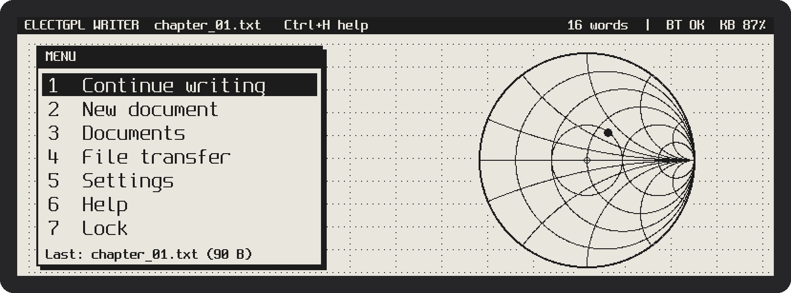

<!-- Add a photo of the real device here, e.g.:
 -->

## Features

- **PDA-style desktop** at boot: a menu over a wallpaper (built-in Smith chart, or your own BMP) with *Continue writing*, *New document*, *Documents*, *File transfer*, *Settings*, *Help* and *Lock*.
- **microSD card support** (FAT): documents can live on the card or in internal flash, selectable in Settings, with a one-key copy of all documents between the two.
- **Markdown preview** (Ctrl+P): a read-only rendered view of the document with headings, bold, italic, strikethrough, inline and fenced code, lists, quotes, links, tables and rules.
- **Keyboard-less "pocket PDA" mode**: the side buttons (UP/DOWN/OK, EXIT, MENU and BOOT) navigate the desktop, the file list and a read-only viewer, so documents can be read without the keyboard.
- **Private documents** (Casio organizer style): documents marked private are hidden until the password is entered; public ones never ask for it. Auto-hide after 5/15/30 minutes idle.
- **Typewriter-style editor** on a 792 × 272 E-Paper panel: 64 columns × 10 lines, soft word-wrap, block cursor, half-page scroll jumps and a scroll bar.
- **BLE keyboard host (HOGP)** implemented on the ESP32-S3. The Report Map is parsed, so 6KRO and NKRO keyboards both work, with Boot Protocol as fallback. Pairing uses **LE Secure Connections with Passkey Entry**: the 6-digit code is shown on the E-Paper and typed on the keyboard. Keyboard battery level appears in the status bar.
- **Spanish (Latin America), Spanish (Spain) and US layouts**, with dead keys (´ ¨ ` ^), AltGr and Caps Lock. The full ISO-8859-1 character set is available (á é í ó ú ñ ü ¿ ¡ …).
- **Low-latency E-Paper pipeline**: hardware SPI, keystroke coalescing while the panel is busy, and an automatic anti-ghosting policy.
- **Documents in internal flash** (LittleFS, UTF-8 `.txt` / `.md`). Autosave runs 3 s after the last keystroke, writes are atomic, and the last document and cursor position are restored at boot.
- **File manager on the device**: open, create, rename and delete documents.
- **File transfer over Wi-Fi**: the device becomes a hotspot and you download, upload or delete notes from any browser. The keyboard stays connected during the transfer.
- **On-screen help** (Ctrl+H).

## Screens

| | |
|---|---|
| 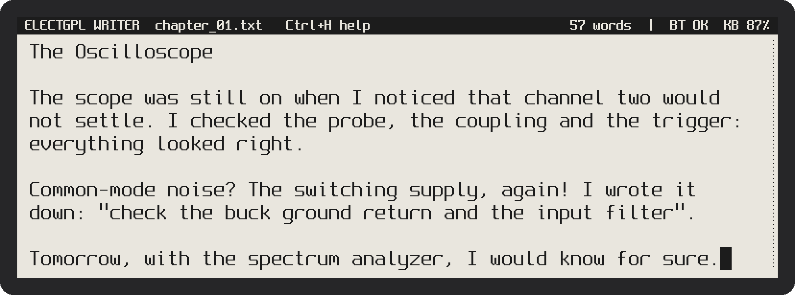 | 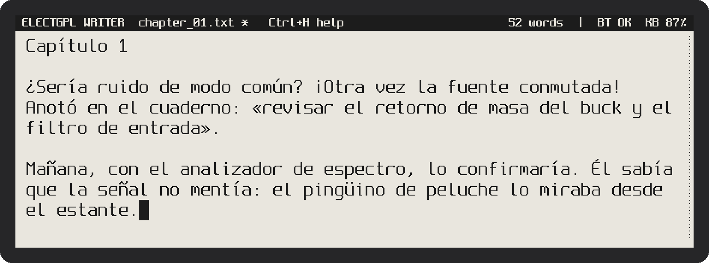 |
| Editor | Editor with Spanish text (Latin-1 font) |
| 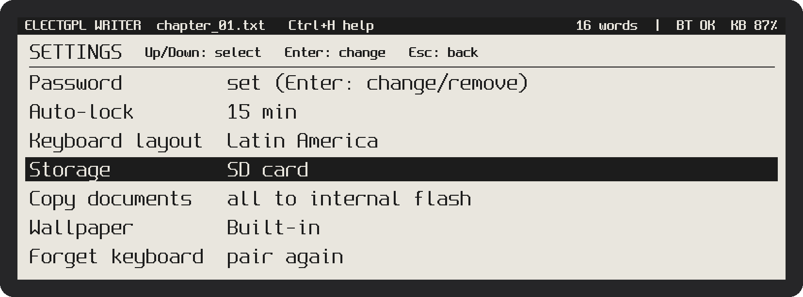 | 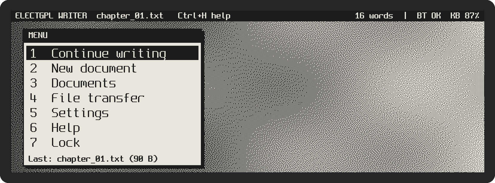 |
| Settings | Desktop with a user BMP wallpaper (Floyd-Steinberg dithered) |
| 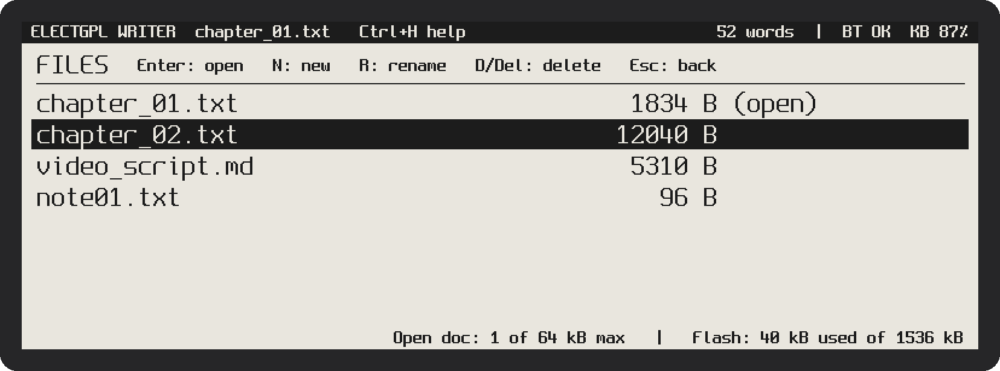 | 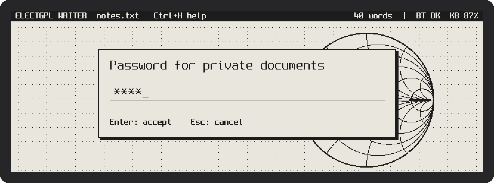 |
| File list with private `[P]` documents | Unlocking the private documents |
| 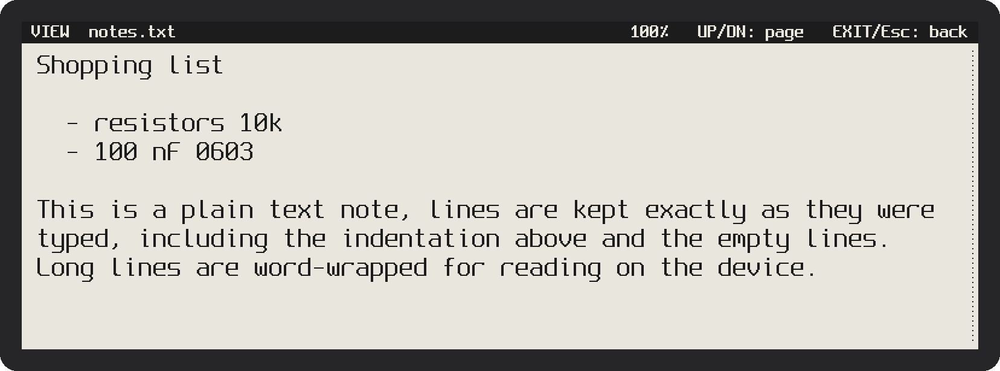 | 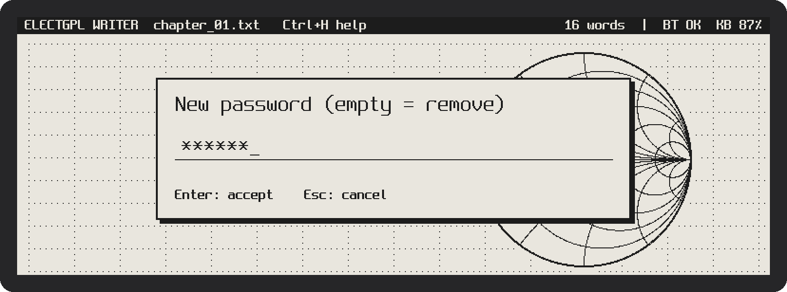 |
| Read-only viewer (.txt), side buttons | Setting a password |
| 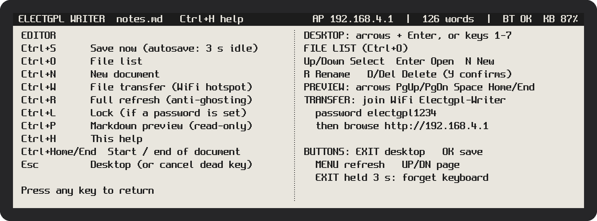 | 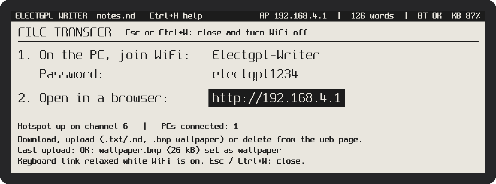 |
| Help screen (Ctrl+H) | File transfer mode (Ctrl+W) |
| 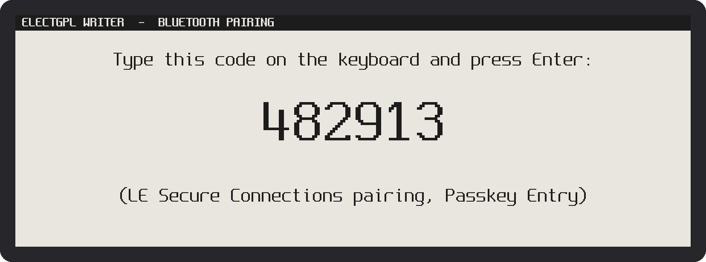 | |
| BLE pairing: passkey shown on the E-Paper | |
| 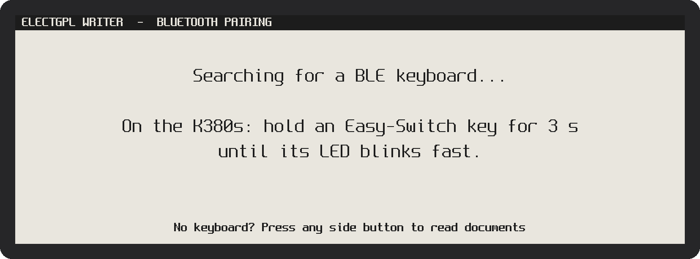 | 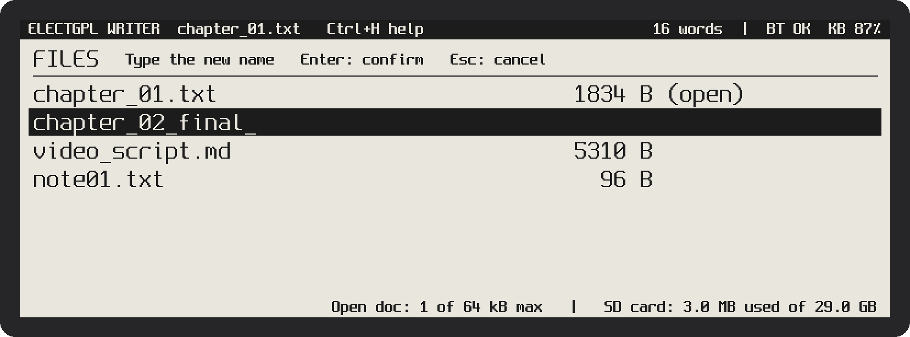 |
| Waiting for a keyboard (any side button skips it) | Renaming a file in place |
| 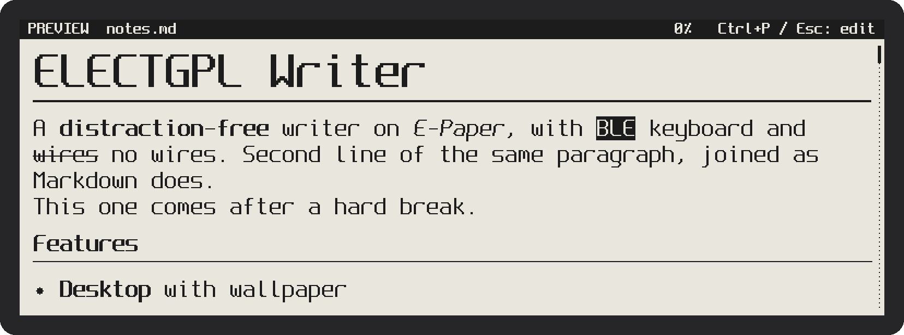 | 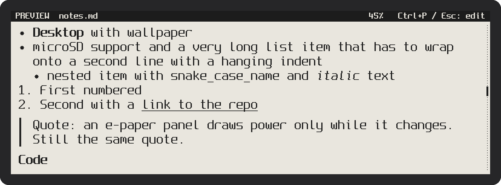 |
| Markdown preview (Ctrl+P) | Lists, links, quotes and headings |
| 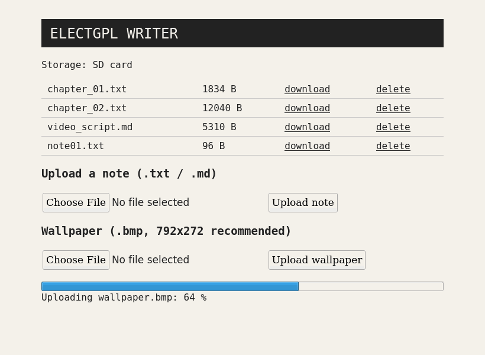 | |
| Web page served at `http://192.168.4.1` | |

> The E-Paper screenshots are the firmware's real framebuffer, rendered off-target from the same drawing code.

## Hardware

| Item | Details |
|---|---|
| Board | Elecrow CrowPanel ESP32 E-Paper HMI 5.79" (ESP32-S3-WROOM-1-N8R8: 8 MB flash, 8 MB OPI PSRAM) |
| Panel | 792 × 272, two SSD1683 controllers in master/slave cascade (800 × 272 RAM with an 8 px seam at x = 396) |
| Keyboard | Logitech K380s (Bluetooth Low Energy) or any BLE HID keyboard. Classic-only keyboards are **not** supported: the ESP32-S3 radio is BLE-only. |

### Pinout used

| Signal | GPIO | Signal | GPIO |
|---|---|---|---|
| EPD SCK (FSPICLK) | 12 | EPD power enable | 7 |
| EPD MOSI (FSPID) | 11 | Button EXIT | 1 |
| EPD CS | 45 | Button MENU | 2 |
| EPD DC | 46 | Button DOWN | 4 |
| EPD RST | 47 | Button OK | 5 |
| EPD BUSY | 48 | Button UP | 6 |
| SD SCK | 39 | SD MISO | 13 |
| SD MOSI | 40 | SD CS | 10 |
| SD power enable | 42 | | |

The microSD card uses its own SPI bus (SPI3), separate from the display (SPI2), as in Elecrow's `5.79_TF` example.

## Build and flash

1. Install **arduino-esp32 core 3.x** (tested with 3.3.12) and the **NimBLE-Arduino** library (h2zero). Any 2.x version from 2.1.0 to 2.5.1 builds; 2.5.1 is recommended.
2. Open `firmware/Electgpl_EPD_Writer/Electgpl_EPD_Writer.ino`. Keep `spleen_fonts.h` and `wallpaper_builtin.h` in the same folder.
3. Select these board settings:

   | Setting | Value |
   |---|---|
   | Board | ESP32S3 Dev Module |
   | Flash Size | 8MB |
   | PSRAM | **OPI PSRAM** (mandatory, the build stops otherwise) |
   | Partition Scheme | 8M with spiffs (3MB APP / 1.5MB SPIFFS) |
   | USB CDC On Boot | set it so that `Serial` goes to the port you monitor |

4. Upload. Resource usage: about 1.28 MB of flash (38 %) and 85 kB of static internal RAM.

Normal uploads do **not** erase your documents. *Erase All Flash Before Sketch Upload* and changing the partition scheme **do**.

## Usage

### Pairing the keyboard

1. Power the device. With no keyboard bonded, it shows the pairing screen.
2. On the K380s, hold an **Easy-Switch** key for 3 s until its LED blinks fast.
3. A 6-digit code appears on the E-Paper. Type it on the keyboard and press **Enter**.

The bond is stored in NVS and later reconnections are automatic. To pair again, hold **EXIT** for 3 s.

### Desktop

The device boots into the desktop. Move with the arrows and press Enter, press the item number (1–7), or use the side buttons. **Esc** in the editor, or **EXIT** / **BOOT**, returns to the desktop (the document is saved first). Without a keyboard, item 1 becomes *Read document*.

### Settings

| Item | Enter does |
|---|---|
| Password | Set, change or remove it (empty new password = remove). Minimum 4 characters. |
| Auto-hide priv. | Hides private documents after Off / 5 / 15 / 30 min idle (needs a password) |
| Keyboard layout | Cycles Latin America / Spain / US |
| Storage | Switches between internal flash and the microSD card |
| Copy documents | Copies every document to the other volume (files that already exist there are kept) |
| Wallpaper | Cycles Built-in / File `/wallpaper.bmp` / None |
| Forget keyboard | Deletes the BLE bond (confirm with Y or OK) |

### Private documents

Like the "secret" area of Casio electronic organizers, the password protects only the documents you choose; the device itself never asks for it at power-up.

- Set a password in **Settings → Password**. In the file list, **P** moves the selected document to the private folder (`/secret`) or back to `/docs`. Private entries are marked `[P]`.
- Private documents are only listed (on the device and on the transfer web page) after desktop item **7 Private: unlock** and the password. **Ctrl+L**, item 7 again (*Private: lock*) or the auto-hide timer hides them; an open private document is closed first.
- A private document is never reopened automatically at power-up.
- After 5 wrong attempts, input is blocked for 30 s, growing with every further failure.
- This is a **privacy feature, not encryption**: files are stored in clear text in flash or on the SD card.
- **Recovery:** hold **MENU + EXIT** while powering up to clear the password (private documents then become visible).

### Side buttons (keyboard-less use)

| Button | Lists, desktop, settings | Editor / viewer |
|---|---|---|
| UP / DOWN | Move the selection (auto-repeat when held) | Page up / down |
| OK | Select (Enter) | Editor: save · Viewer: next page |
| EXIT | Back (Esc) | Back |
| BOOT | Desktop | Desktop |
| MENU | Full refresh (clears ghosting) | Full refresh |
| EXIT held 3 s | Forget the bonded keyboard | |

Documents opened with a button, or while no keyboard is linked, open in the **read-only viewer**: Markdown files are rendered, other files are shown as plain text with their line breaks and indentation. If no keyboard has ever been paired, any side button skips the pairing screen. Items that need typing (new document, password) ask for the keyboard.

### Markdown preview (Ctrl+P)

A read-only rendered view that opens at the paragraph under the cursor. **Esc** or **Ctrl+P** returns to the editor; arrows scroll by line, **PgUp / PgDn / Space** by page, **Home / End** jump to the ends. Editing always happens on the plain text.

| Markdown | Rendering on the 1-bit panel |
|---|---|
| `# Title` | 2× size, bold, underlined |
| `## Title` / `### Title` | Bold with a rule / bold |
| `**bold**`, `*italic*`, `***both***` | Double-strike, 3 px shear |
| `~~strike~~` | Line through the text |
| `` `code` `` / ```` ``` ```` block | Inverted cells / left bar, verbatim |
| `- item`, `1. item` (nested by indentation) | Bullet or number with a hanging indent |
| `> quote` (nested `>>`) | Vertical bar per level |
| `[text](url)` / `` | Underlined text / `[image: alt]` |
| `\| table \|` rows | Verbatim, monospaced |
| `---` | Horizontal rule |

Paragraph lines are joined as in Markdown; end a line with two spaces for a hard break.

### Wallpaper

Upload any uncompressed BMP (1/4/8/24/32 bpp) from the transfer web page, or copy it as `/wallpaper.bmp` to the root of the SD card. 792 × 272 is ideal; larger images are centre-cropped and smaller ones centred. Colour and grey levels are converted to 1 bit with Floyd–Steinberg dithering. The built-in wallpaper is generated by `tools/mkwall.py`.

### Keyboard shortcuts

| Keys | Action |
|---|---|
| Ctrl+S | Save now (autosave runs 3 s after the last keystroke) |
| Ctrl+O | File list |
| Ctrl+N | New document (`note01.txt`, `note02.txt`, …) |
| Ctrl+W | File transfer mode (Wi-Fi hotspot) on/off |
| Ctrl+R | Full refresh (clears ghosting) |
| Ctrl+H | Help screen |
| Ctrl+L | Hide private documents |
| Ctrl+P | Markdown preview / plain-text viewer (read-only) |
| Esc | Desktop (or cancel a pending dead key) |
| Ctrl+Home / Ctrl+End | Start / end of document |
| Arrows, Home, End, PgUp, PgDn | Navigation |

### File list (Ctrl+O)

| Keys | Action |
|---|---|
| Up / Down | Select |
| Enter | Open |
| N | New document |
| R | Rename in place (a-z, 0-9, `.`, `_`, `-`; `.txt` is added if there is no extension) |
| D or Del, then Y | Delete |
| Esc | Back to the editor |

The footer shows the size of the open document against its limit, and the flash used against the total.


### File transfer (Ctrl+W)

1. Press **Ctrl+W**. The device creates the Wi-Fi network **`Electgpl-Writer`** (password **`electgpl1234`**).
2. Join that network from the PC or phone.
3. Browse to **`http://192.168.4.1`**. From there you can download or delete notes, and upload notes (`.txt` / `.md`) or a wallpaper (`.bmp`) with a progress bar. The result of the last upload is also shown on the device.
4. Press **Esc** or **Ctrl+W** to close the hotspot.

Notes:
- Wi-Fi and BLE share the single 2.4 GHz radio (ESP-IDF software coexistence). While the hotspot is on, the firmware gives Wi-Fi priority: a connected keyboard is asked for a relaxed link (30–50 ms interval, slave latency 4), and if the keyboard is not connected, BLE scanning and reconnection are paused until the transfer is closed (use the **EXIT** button in that case).
- The currently open document cannot be deleted or overwritten from the web page.
- Uploads are sent by the page's JavaScript as a raw request body (`application/octet-stream`, file name in an `X-Name` header), not as `multipart/form-data`. This bypasses the WebServer multipart parser, which closes the connection without any response when it aborts, and makes upload progress and error messages visible.
- If your home LAN also uses the `192.168.4.x` subnet, disconnect the PC from it while transferring.

## How it works

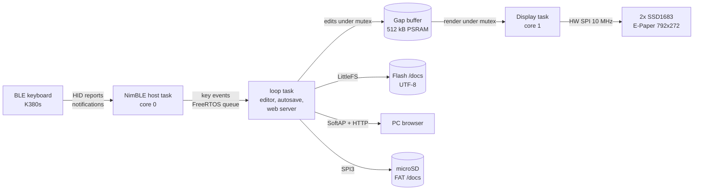

### E-Paper pipeline

The SSD1683 partial refresh time is fixed by the waveform (LUT), not by the size of the updated area. The panel manufacturer specifies about 0.3 s at 25 °C, and other listings of the same panel give 0.42 s. Latency per keystroke is therefore dominated by the waveform:

| Stage | Time |
|---|---|
| BLE connection interval | 7.5–30 ms (negotiated by the keyboard) |
| Text layout + render into the framebuffer | a few ms |
| SPI transfer, full frame (2 × 13 600 B at 10 MHz) | about 22 ms |
| Partial-refresh waveform | about 300–420 ms |
| **Total** | **about 0.35–0.45 s** |

At 5 characters per second, typing is faster than the panel can refresh. A dedicated display task therefore **coalesces** keystrokes: while BUSY is high, keys accumulate in the document, and when the panel is free the latest state is drawn in a single partial refresh. Text appears in small bursts of 2–3 characters and no keystroke is lost.

Partial refreshes accumulate ghosting, so the firmware runs a full refresh:

- after 30 partial refreshes, at the next pause of 1.5 s or longer;
- unconditionally after 250 partial refreshes;
- once per idle period, 60 s after typing stops;
- on demand with Ctrl+R or the MENU button.

The controller sequences come from the vendor sample code. The only driver change is replacing bit-banged GPIO with **hardware SPI** (GPIO11/12 are the IOMUX pins of FSPI), which cuts the frame transfer from roughly 100–200 ms (estimated) to about 22 ms.

### BLE keyboard host (HOGP)

- **Discovery.** The firmware scans for devices advertising the HID service (0x1812) or a keyboard appearance. If a bond exists, it also tries a direct connection to the bonded address, which covers directed advertising.
- **Security.** The ESP32 declares the *DisplayOnly* I/O capability and the keyboard is *KeyboardOnly*, so pairing uses **Passkey Entry**. The passkey is injected directly into the NimBLE Security Manager with `ble_sm_inject_io()`, which works with every NimBLE-Arduino 2.x version. Versions older than 2.4.0 have no `onPassKeyDisplay()` callback in the client and would otherwise never complete pairing.
- **Reports.** The Report Map (0x2A4B) is read and parsed by a minimal HID descriptor parser (HID 1.11, §6.2.2) that locates the Keyboard/Keypad (0x07) input fields, both arrays (6KRO) and bitmaps (NKRO). Only reports whose Report Reference (0x2908) matches a keyboard report ID are subscribed. If none is found, the firmware switches to Boot Protocol (0x2A4E → 0, subscribe to 0x2A22).
- **Host-side logic.** Auto-repeat is generated by the host (500 ms delay, 25 characters per second), as are layout translation and dead keys.

### Text engine

- The document is stored in a **gap buffer** in PSRAM, one byte per character (ISO-8859-1), so every character maps to exactly one 12 × 24 glyph cell. On disk the text is UTF-8.
- Soft word-wrap is recomputed from the text. Vertical cursor movement keeps the preferred column.
- Font: **Spleen 12×24** for the text and **Spleen 8×16** for the status bar, converted from BDF with `tools/bdf2h.py`.

### Storage

- **Internal flash:** LittleFS in the `spiffs` partition (0x180000 = 1.5 MB), folder `/docs`. Saves go to `/docs/.tmp` and are renamed over the original (littlefs rename is atomic).
- **microSD:** FAT, folder `/docs`. FAT `rename()` does not overwrite, so the old file is first moved to a hidden `/docs/.bak_<name>`; if power fails in between, the next open recovers it.
- The last document and cursor position are kept in NVS per volume.

### BLE link loss

When the keyboard switches to another host (K380s Easy-Switch), the firmware keeps retrying the connection in the background at a 30 % scan duty cycle (30 ms window every 100 ms), and only redraws the E-Paper when the *visible* state changes (BT OK ↔ BT --). Any held key is released so auto-repeat cannot run away.

## Limits

| Item | Value |
|---|---|
| Maximum document size | 512 kB in RAM, about 85 000 words (`DOC_MAX`; 64 kB without PSRAM) |
| Total storage | 1.5 MB internal partition (minus LittleFS overhead), or the whole microSD card |
| Recommended document size | under about 100 kB (one file per chapter): every save rewrites the whole file and every keystroke re-flows the text |
| Character set | ISO-8859-1. Other Unicode characters in imported files become `?` |
| Not implemented yet | undo, search, selection / clipboard |

## Configuration

All user options live in *Section 1* of the sketch:

| Define | Default | Meaning |
|---|---|---|
| `KBD_LAYOUT` | `LAYOUT_LATAM` | `LAYOUT_LATAM`, `LAYOUT_ES` or `LAYOUT_US` |
| `KBD_NAME_FILTER` | `""` | Only connect to keyboards whose name contains this text |
| `EPD_SPI_HZ` | 10 MHz | SPI clock for the SSD1683 |
| `CLEAN_SOFT_PARTIALS` / `CLEAN_HARD_PARTIALS` | 30 / 250 | Anti-ghosting policy |
| `AUTOSAVE_MS` | 3000 | Autosave delay |
| `REPEAT_DELAY_MS` / `REPEAT_RATE_MS` | 500 / 40 | Key auto-repeat |
| `DOC_MAX` | 512 kB | Document buffer in PSRAM |
| `AP_SSID` / `AP_PASS` / `AP_CHANNEL` | `Electgpl-Writer` / `electgpl1234` / 6 | File-transfer hotspot |
| `SD_SPI_HZ` | 20 MHz | microSD SPI clock |
| `PW_MIN_LEN` / `PW_HASH_ROUNDS` | 4 / 2000 | Password rules |

The keyboard layout, storage volume, wallpaper, auto-lock and password are runtime settings stored in NVS; `KBD_LAYOUT` is only the first-boot default.

## Troubleshooting

| Symptom | Cause and fix |
|---|---|
| Boot loop with `assert failed: block_locate_free tlsf_control_functions.h` right after `btdm: bss start …` | On arduino-esp32 3.3.x, `initArduino()` releases the Bluetooth controller RAM unless a library declares BLE usage, and NimBLE-Arduino does not. The sketch defines `extern "C" bool btInUse() { return true; }` to keep that RAM reserved. Do not remove it. |
| `'onPassKeyDisplay' marked 'override', but does not override` | This came from an old sketch revision combined with NimBLE-Arduino < 2.4.0. The current code does not depend on that callback. |
| No `[BLE]` / `[FS]` / `[EPD]` lines in the serial monitor | `Serial` is going to another port. Check *USB CDC On Boot*. |
| Build stops with `Select Tools > PSRAM > OPI PSRAM` | The Arduino default for *ESP32S3 Dev Module* is PSRAM = Disabled. Without PSRAM the WiFi driver cannot initialise next to the BLE stack (`esp_wifi_init` → `ESP_ERR_NO_MEM`, logged as `Failed to deinit Wi-Fi driver (0x3001)`). Select **OPI PSRAM**. |
| Transfer screen reports `The WiFi hotspot could not start` | The reason and the free internal RAM are shown on screen; also check the `[WIFI]` lines in the serial log. Never call `WiFi.setSleep(false)` while BLE is active. |
| Ghosting | Press Ctrl+R, or lower `CLEAN_SOFT_PARTIALS`. |
| SPI artifacts on the panel | Lower `EPD_SPI_HZ` to 4 MHz. |
| Upload page says *Network error*, transfer screen shows *PCs connected: 0* | The PC left the hotspot (Windows may jump back to a known network when the link degrades). Rejoin `Electgpl-Writer`. Firmware before this fix scanned BLE at 100 % duty while the keyboard was away, starving Wi-Fi. |
| Browser shows `ERR_EMPTY_RESPONSE` after an upload | Older firmware used multipart uploads; update. If it persists, set *Tools → Core Debug Level → Error* and check the `[WEB]` and WebServer lines in the serial log. |
| Settings shows *(no SD card)* | The card is only mounted at boot: insert it (FAT32) and restart. |
| Forgot the password | Hold MENU + EXIT while powering up (private documents become visible). |

## Repository layout

```
firmware/Electgpl_EPD_Writer/
    Electgpl_EPD_Writer.ino   firmware (single sketch, sections 0-15)
    spleen_fonts.h            generated font bitmaps
    wallpaper_builtin.h       generated built-in wallpaper
tools/bdf2h.py                BDF -> C header font converter
tools/mkwall.py               built-in wallpaper generator
docs/img/                     screenshots used in this README
LICENSES/                     third-party licenses
```

## Credits and license

- **Spleen** bitmap fonts © Frederic Cambus, BSD 2-Clause. See `LICENSES/Spleen-BSD-2-Clause.txt`.
- The SSD1683 initialization and refresh sequences are based on the panel vendor's sample code.
- **NimBLE-Arduino** by h2zero (Apache 2.0) is used as a library dependency and is not included here.
- Firmware © ELECTGPL. Released under the MIT License; see `LICENSE`.

Made by **ELECTGPL** — electronics videos in Spanish on YouTube.
